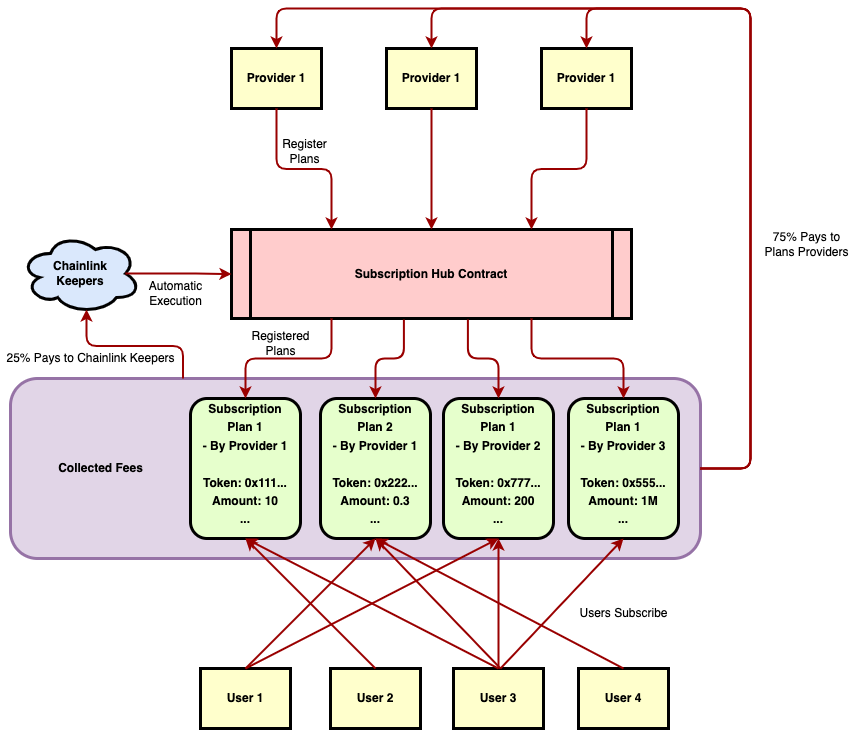

# Subscription Hub

## Update

In this branch (feat-ud-resolution) this application is integrated with Unstoppable Domain resolution.

Youtube Demo: https://youtu.be/euiSQS9By_c

Live version: ud-res-subscription-hub.vercel.app

Contact me: Discord handle: Soptq#9775 UD Email: aplenty$dot$brier-0i$at$icloud$dot$com

## Introduction

Compared to selling products individually, Subscriptions offer periodic uses and accesses to products, which could effectively help developers gain continues revenue to keep developing, and at the same time save money for users if they are not actively using. This business model contributes to a win-win situation for both customers and providers.

However, due to the lack of automatic / conditional execution of contracts on vanilla EVM, such a business model is hard to implement. Consequently, Subscription Hub is therefore implemented to allow service providers to register their subscription plans, and users to subscribe these plans.



Subscription Hub is a decentralized, open-source, and neutral solution to enable subscription business models on chain, so both service providers and users can trust it, and benefit from it. It mainly utilizes Chainlink Keepers to trustlessly perform periodic subscription fee charging on the blockchain.

Subscription Hub features an innovative tasks scheduling algorithm, so that the charging process of different users are grouped in the same transaction as much as possible to reduce gas fees.

In a nutshell, Subscription Hub allows service providers to have full control of their plans (including what tokens to receive, how much to charge, and how often to charge). It uses innovative algorithms written in solidity to automatically plan the subscription tasks, dealing with all possible scenarios and edge cases (i.e., users have insufficient balance, the subscription plan is not available, users unsubscribe the plans halfway etc.).

## Features

1. **Task Scheduling Algorithm**: As the contract is responsible for periodically charing subscribers, it is crucial to efficiently pre-schedule these periodical charging tasks so that they are neither stacked together in the same block to run out of the block gas limit, nor scattered and therefore makes the gas inefficient to use. It is ideal that all tasks are well-scheduled so that every block that contains tasks, contains averagely N tasks, where N is configurable. Note that this tasks scheduling algorithm must also be efficient enough.
2. **Corner Cases**: There are many corner cases during the life time of the subscription: What if the subscriber has insufficient balance to pay for the next subscription period; What if the subscriber decides to unsubscribe during one subscription period, does the subscription period expires immediately or lasts until the end of current period; What will happen to subscribers if their subscription plan is terminated by the service provider.
3. **Safety**: Due to the nature of the subscription business model and ERC20 token, the contract needs to get approved for transferring users tokens for paying the subscriptions. To minimize the attack surface, the token transferring related codes must be protected seriously.

## Get Started
### Installation

```shell
git clone https://github.com/Soptq/subscription-hub
cd subscription-hub
yarn
```

### Compile the contract

```shell
npx hardhat compile
```

### Test the contract

```shell
npx hardhat test
```

### Frontend

```shell
yarn start
```

## Deployed Contract Address

BSC Testnet: 0x6fF7C7AA3E61Cc657BF996a0F68aA53736F0eBc4
